# Levantamento de Requisitos — AFKnights

> Documento vivo. Última atualização: 2026-06-07.

## 1. Visão geral

O `phaser-afknights` é hoje um **RPG de combate por turnos** single-player, construído com Phaser 3 + Vite, totalmente client-side (sem backend ativo). O objetivo desta evolução é transformá-lo em um **idle RPG online**: combate automático, equipamentos estilo MOBA/Warcraft, social com chat, PvP, world boss, raid boss, ranking global e persistência via backend próprio.

### Diagrama de arquitetura



> Fonte: [`doc/afknights_full_upgraded_architecture.svg`](./afknights_full_upgraded_architecture.svg) — diagrama oficial da engenharia do projeto. Abra o arquivo direto no navegador para ver os labels com nitidez.

O diagrama cobre 7 camadas, da esquerda para a direita / topo para a base:

| Camada | Componentes |
|---|---|
| **CLIENT** | Phaser 3 canvas · IdleScene · PvPScene · BossScene · UIScene · Vite + ES Modules · client state (party + 6 slots de equipamento + debuff tracker) · Socket.io client (`combat:tick`, `boss:damage`, `chat:message`) · UI layer com phaser3-rex-plugins (HUD, inventário, chat overlay) |
| **EDGE** | Static assets / CDN (Vite build → Cloudflare) · HTTPS / WSS · TLS termination · Rate limit |
| **GATEWAY** | Throttle guard (NestJS) · Auth edge (Supabase JWT verify) · REST API · Socket.io gateway · Guards (`AuthGuard` JWT) · Validation (`class-validator` + DTO pipes) |
| **NESTJS** | `AuthModule` · `PlayerModule` · `CombatModule` · `PvPModule` · `BossModule` · `ItemsModule` · `SocialModule` · `ChatModule` · `RankModule` · `RewardsModule` |
| **CACHE/QUEUE** | Redis (Sorted Set → leaderboard em O(log n); Key/Val → boss HP + sessões ativas) · BullMQ sobre Redis (`loot-drop-queue`, `daily-reward-cron`, `matchmaking-queue` com workers + retry) |
| **SUPABASE** | Supabase Auth (Email · OAuth · JWT) · PostgreSQL (`players`, `items`, `bosses` etc.) · Supabase Realtime (Presence · broadcasts) · Storage (sprites · save exports) |
| **OBS/INFRA** | Sentry (exceções + stack trace, alertas em prod) · Pino logs (JSON estruturado, nível por módulo) · Prometheus + Grafana (tick latency, players online, queue depth, boss events) · Deploy: Railway + Docker |

O padrão de **write-through** (persistir no Postgres ao finalizar) e o roteamento Socket.io por canais (`global`, `dm:`, `pvp:`, `raid:`, `world-boss:`) também aparecem explicitamente no diagrama.

Este documento descreve **o que** precisa existir. O passo-a-passo técnico de **como** entregar está em `doc/tarefas.md`.

## 2. Glossário

| Termo | Significado |
|---|---|
| **Idle** | Combate em que o jogador não toma decisões mecânicas; personagens atacam sozinhos em intervalos regulares. |
| **Debuff** | Efeito negativo temporário aplicado a uma unidade (ex: redução de velocidade ou ataque). |
| **Slot** | Posição de equipamento em um personagem. Cada personagem terá 6 slots independentes. |
| **World boss** | Boss global, compartilhado por todos os jogadores online, com janela de tempo para ser derrotado. |
| **Raid boss** | Boss de sala fechada, atacado em grupo (amigos / time) com janela de tempo. |
| **Party** | Grupo de até 3 personagens do jogador (estrutura atual: `party1`, `party2`, `party3`). |
| **Encounter** | Conjunto de inimigos a enfrentar em uma batalha. Hoje vive em `public/assets/enemy_encounters/*.json`. |
| **PvP** | Player vs Player — combate idle entre dois jogadores reais. |
| **Tick** | Pulso de tempo do motor de combate (ataque ou aplicação de status). |

## 3. Requisitos Funcionais

Template de cada item:

```
RF-XX — Título
- Descrição
- Justificativa
- Critérios de aceitação
- Dependências
- Prioridade
- Impacto técnico
```

---

### RF-01 — Combate completamente idle

- **Descrição:** Personagens do jogador não têm mais HP nem MP. Eles atacam automaticamente em um loop contínuo, baseado em `speed`. Apenas inimigos têm vida e podem morrer. A vitória acontece quando todos os inimigos vivos zeram a vida.
- **Justificativa:** Foco do gênero idle. Remove a microgestão de HP/MP e simplifica a UI.
- **Critérios de aceitação:**
  - PlayerUnit não possui campos `health`, `mana`, `max_health` em runtime.
  - O combate começa sozinho e não exige cliques de ação.
  - Personagens executam ataque a cada `tick = ceil(1000 / speed)` ms (valor configurável).
  - Vitória dispara quando `enemy_units.countActive() === 0`.
  - Não existe mais derrota por HP zerado (apenas timeout, se houver).
- **Dependências:** Nenhuma (refator base).
- **Prioridade:** Alta.
- **Impacto técnico:** `src/prefabs/Unit/Unit.js` (linhas 39, 52-66), `src/prefabs/Unit/PlayerUnit.js`, `src/scenes/GameScene.js` (linhas 101-125, 196-213 — o `PriorityQueue` é substituído por timers individuais), `src/prefabs/Attacks/PhysicalAttack.js`, `public/assets/default_data.json` (remoção de HP/MP dos personagens).

---

### RF-02 — Inimigos não atacam: aplicam debuffs

- **Descrição:** Inimigos perdem o ataque ofensivo. A cada turno deles, aplicam 1 debuff aleatório em um personagem do jogador: lentidão (reduz velocidade de ataque), redução de ataque, redução de defesa, atordoamento (pausa ataques por X ticks), envenenamento (drena recursos futuros, se houver).
- **Justificativa:** Combate idle precisa de tensão sem que o jogador morra. Debuffs tornam decisões pré-batalha (equipamento) relevantes.
- **Critérios de aceitação:**
  - `EnemyUnit.act()` nunca chama `attack.hit()`.
  - Existe um sistema de status effects com `tipo`, `magnitude` e `duração` em ticks.
  - Pelo menos 4 tipos de debuff disponíveis.
  - Debuffs ativos são visíveis no HUD do personagem afetado.
  - Debuffs expiram sozinhos após a duração.
- **Dependências:** RF-01.
- **Prioridade:** Alta.
- **Impacto técnico:** `src/prefabs/Unit/EnemyUnit.js` (linhas 32-36), novo módulo `src/prefabs/combat/StatusEffect.js`, `src/prefabs/HUD/ShowPlayerUnit.js` (linhas 36-71 — substituir HP/MP por ícones de status).

---

### RF-03 — Lista de amigos e chat (global + privado)

- **Descrição:** Jogador pode adicionar amigos por nome, aceitar/recusar pedidos, ver status online dos amigos e conversar via chat global (canal único) ou chat privado 1:1.
- **Justificativa:** Engajamento social, pré-requisito para PvP e raid boss.
- **Critérios de aceitação:**
  - Endpoints REST para gerenciar amizades (request, accept, decline, remove).
  - Chat global funciona em tempo real entre todos os clientes conectados.
  - Chat privado entrega mensagens só ao par de usuários.
  - Status online é atualizado em ≤ 5 s após conexão/desconexão.
  - Histórico de mensagens persistido para reabertura da janela.
- **Dependências:** RF-09 (login), RNF-01 (backend).
- **Prioridade:** Média.
- **Impacto técnico:** Novos módulos NestJS `SocialModule` (amigos) + `ChatModule` (gateway Socket.io). **Presença online via Supabase Realtime** (broadcasts + presence). Histórico em Postgres (`messages`). Nova cena/overlay frontend (`ChatScene`).

---

### RF-04 — PvP online (amigos e matchmaking aleatório)

- **Descrição:** Jogador pode desafiar um amigo online para uma batalha PvP idle, ou entrar em fila de matchmaking aleatório. O combate roda no backend (autoritativo) e os dois clientes assistem o mesmo resultado.
- **Justificativa:** Conteúdo competitivo principal.
- **Critérios de aceitação:**
  - Convite direto a amigo (via lista de amigos).
  - Fila de matchmaking aleatório com tempo médio de espera < 30 s (quando há fila).
  - Combate é resolvido pelo backend; cliente apenas renderiza.
  - Resultado é gravado em `pvp_matches` e contabiliza no ranking.
  - Desistência (refresh, fechar aba) conta como derrota.
- **Dependências:** RF-01 (motor de combate idle), RF-03 (amigos), RF-09 (login), RF-10 (ranking).
- **Prioridade:** Média.
- **Impacto técnico:** Novo `PvPModule` NestJS com Socket.io. **Matchmaking via BullMQ** (`matchmaking-queue` com workers + retry). Sessões ativas em Redis. Cliente: nova cena `PvpScene`. Schema: `pvp_matches`.

---

### RF-05 — Recompensas diárias

- **Descrição:** Ao logar uma vez por dia (24 h, fuso UTC), o jogador resgata uma recompensa fixa (ouro, item ou XP), com calendário de 7 dias rotativo. Recompensas crescem por dia consecutivo de login.
- **Justificativa:** Retenção. Mecânica padrão de jogos idle.
- **Critérios de aceitação:**
  - Backend decide quando o dia "virou" (não confiar no relógio do cliente).
  - Jogador só resgata 1 recompensa por janela de 24 h.
  - Sequência (`streak`) reseta após 48 h sem resgatar.
  - UI exibe os 7 dias com recompensa do dia destacada.
- **Dependências:** RF-09 (login), RNF-01.
- **Prioridade:** Média.
- **Impacto técnico:** `RewardsModule` NestJS. **Job recorrente `daily-reward-cron` via BullMQ** (reseta janelas em UTC, dispara notificações). Cliente: nova tela de resgate. Schema: `daily_rewards`, `daily_streaks`.

---

### RF-06 — Itens de equipamento (6 slots, estilo MOBA/Warcraft)

- **Descrição:** Cada personagem da party tem 6 slots de equipamento. Cada item ocupa 1 slot e concede bônus a atributos (ataque, defesa, velocidade, vida do alvo causada, crítico, lifesteal etc.). Itens podem ser equipados/desequipados antes da batalha.
- **Justificativa:** Profundidade estratégica e progressão visível.
- **Critérios de aceitação:**
  - Cada `party_data[N]` tem `equipment: [null × 6]`.
  - Equipar um item soma seus bônus aos `stats` efetivos do personagem em runtime.
  - Desequipar remove os bônus corretamente (sem leaks).
  - UI mostra 6 slots por personagem, ícones e tooltips com bônus.
  - Catálogo de pelo menos 12 itens iniciais (2 por slot conceitual).
- **Dependências:** Nenhuma rígida; idealmente após RF-01.
- **Prioridade:** Alta.
- **Impacto técnico:** `src/inventory/Equipment.js` (linha 32 — hoje guarda bônus mas nunca aplica). Reescrita com `apply_to(unit)` / `remove_from(unit)`. Novo catálogo `public/assets/items/catalog.json`. Consolidar `src/inventory/Item.js` e `src/prefabs/items/Item.js` (hoje duplicados). Nova UI `EquipmentMenu`.

---

### RF-07 — World boss

- **Descrição:** Um boss global aparece em janelas programadas (ex: a cada 12 h). Todos os jogadores online podem atacá-lo. O dano de cada jogador é acumulado. Quando a vida do boss zera (ou a janela expira), recompensas são distribuídas proporcionalmente ao dano.
- **Justificativa:** Evento coletivo. Alimenta o ranking de dano.
- **Critérios de aceitação:**
  - Vida do boss é única e global (persistida no backend).
  - Janela de tempo configurável (default: 12 h).
  - Cada ataque do jogador é validado no backend (anti-cheat).
  - Dano total por jogador é gravado em `boss_damage`.
  - Recompensas distribuídas em escalões (top 10, top 100, participantes).
- **Dependências:** RF-01, RF-09, RNF-01, RNF-04.
- **Prioridade:** Média.
- **Impacto técnico:** `BossModule` NestJS (world boss + raid boss compartilham módulo). **HP global do boss em Redis key/val** (decremento atômico via `DECRBY`) — persiste em Postgres só ao fechar a janela. **Spawn de instâncias agendado via BullMQ** (`world-boss-cron`). **Drop de loot via `loot-drop-queue`** (workers + retry). Schema: `boss_damage`, `boss_instances`.

---

### RF-08 — Raid boss (grupo)

- **Descrição:** Jogador cria uma sala de raid e convida amigos (ou time). Sala tem tamanho fixo (ex: 4 jogadores). Boss tem mais vida que o world boss e uma janela de tempo menor (ex: 30 min). Recompensa fixa ao matar dentro do tempo; nada se falhar.
- **Justificativa:** Conteúdo cooperativo. Reforça uso do sistema de amigos.
- **Critérios de aceitação:**
  - Lobby de raid via Socket.io: criar, convidar, entrar, começar.
  - Combate roda autoritativo no backend.
  - Se boss morre dentro da janela, todos recebem recompensa.
  - Se a janela expira, sala se dissolve sem recompensa.
- **Dependências:** RF-03 (amigos), RF-04 (motor PvP backend reaproveitado), RF-09.
- **Prioridade:** Baixa.
- **Impacto técnico:** Reutiliza `BossModule`. Gateway Socket.io (`raid:<roomId>`). **Estado da sala em Redis** (membros, HP do boss, expiração). **Drop em `loot-drop-queue` (BullMQ)** ao matar dentro do tempo. Cliente: cenas de lobby e sala.

---

### RF-09 — Sistema de login

- **Descrição:** Substituir o `TitleScene.login()` atual (que só instancia `PlayerData` em memória, ver `src/scenes/TitleScene.js:37-40`) por autenticação real via Supabase Auth (e-mail/senha; OAuth opcional em fase posterior). JWT é guardado no `localStorage` e enviado em todas as chamadas ao backend.
- **Justificativa:** Pré-requisito de toda persistência e funcionalidade online.
- **Critérios de aceitação:**
  - Tela de login com campos e-mail/senha + link para registro.
  - Erros de credencial são mostrados ao usuário.
  - JWT válido sobrevive a refresh da página.
  - Logout limpa o JWT e volta para TitleScene.
- **Dependências:** RNF-01.
- **Prioridade:** Alta.
- **Impacto técnico:** `src/scenes/TitleScene.js`, novo `src/services/api.js` (cliente HTTP com JWT). `AuthModule` NestJS. **JWT do Supabase verificado na edge (`AuthGuard`)** antes de qualquer rota protegida. Schema: `users` (Supabase Auth gerencia).

---

### RF-10 — Ranking global

- **Descrição:** Três leaderboards independentes acessíveis em uma tela única com abas:
  1. Mais vitórias em PvP.
  2. Mais dano causado em world boss (acumulado por instância).
  3. Mais dano em raid boss (recordes individuais).
- **Justificativa:** Conteúdo competitivo de longo prazo.
- **Critérios de aceitação:**
  - Backend expõe top 100 de cada categoria.
  - Frontend atualiza ranking a cada 30 s enquanto aberto.
  - Jogador vê sua própria posição mesmo fora do top 100.
- **Dependências:** RF-04 (PvP), RF-07 (world boss), RF-08 (raid boss).
- **Prioridade:** Média.
- **Impacto técnico:** `RankModule` NestJS. **Leaderboards em Redis Sorted Sets** (`ZADD` em cada vitória / dano de boss; `ZRANGEBYSCORE` para top N em O(log n)). Postgres é só backup de longo prazo. Cliente: cena `RankingScene`.

---

### RF-11 — Persistência online de `player_data`

- **Descrição:** Toda mudança em `player_data` (party, inventário, equipamento, ouro, nível, XP) é gravada no backend em tempo real. Refresh da página recarrega o estado real do servidor.
- **Justificativa:** Hoje o estado vive em `scene.cache.game.player_data` e é perdido a cada refresh. A chamada Firebase comentada em `src/scenes/GameScene.js:186` confirma que isso era a intenção original.
- **Critérios de aceitação:**
  - `GameScene.rewards()` (linhas 146-188) chama API ao distribuir recompensas.
  - Login carrega o estado do servidor antes de iniciar `GameScene`.
  - Conflito de versão é resolvido pelo servidor (write-through).
- **Dependências:** RF-09, RNF-01, RNF-03.
- **Prioridade:** Alta.
- **Impacto técnico:** `PlayerModule` NestJS (perfil, XP, gold). `src/services/api.js` no cliente. Schema: `player_data`, `parties`, `inventory`, `equipment`. **Save exports e sprites custom em Supabase Storage**.

---

## 4. Requisitos Não-Funcionais

### RNF-01 — Arquitetura backend

Stack alvo confirmada (ver `doc/afknights_full_upgraded_architecture.svg`):

- **Edge:** Cloudflare (CDN para assets do build Vite, terminação TLS, rate limit/WAF).
- **Gateway:** NestJS expondo REST API + Socket.io gateway. Guards: `AuthGuard` (JWT do Supabase), `ThrottleGuard` (rate limit por usuário/IP). Validação por DTO pipes com `class-validator`.
- **Módulos NestJS:** `AuthModule`, `PlayerModule`, `CombatModule`, `PvPModule`, `BossModule`, `ItemsModule`, `SocialModule`, `ChatModule`, `RankModule`, `RewardsModule`.
- **Cache/Queue:** **Redis** (Sorted Sets para leaderboards em O(log n); key/val para HP de boss global e sessões ativas) + **BullMQ** sobre Redis (`loot-drop-queue`, `daily-reward-cron`, `matchmaking-queue` — workers com retry).
- **Persistência gerenciada:** Supabase Auth (e-mail + OAuth + JWT) · Supabase Postgres (`players`, `items`, `bosses` etc.) · Supabase Realtime (presence + broadcasts) · Supabase Storage (sprites custom + save exports).
- **Repositório:** monorepo. Backend em `server/`, frontend continua na raiz. Comunicação cliente↔backend via HTTPS/WSS por trás do Cloudflare.

### RNF-02 — Latência

- Tick de combate idle (PvP / boss) processado no backend a cada ≤ 250 ms.
- Mensagens de chat entregues em ≤ 500 ms p95.
- Atualização de ranking via Redis Sorted Set: leitura em ≤ 50 ms.
- Decremento de HP do world boss (Redis `DECRBY`): ≤ 10 ms.

### RNF-03 — Persistência

Toda mutação de `player_data` segue padrão **write-through**: cliente envia → backend grava no Postgres do Supabase → backend retorna estado atualizado → cliente aplica. Estado quente (sessões, HP do boss, posições da fila) vive em Redis e é persistido em Postgres ao "finalizar" o evento (fim de batalha, fim da janela do boss). Cliente nunca persiste estado entre sessões.

### RNF-04 — Segurança e anti-cheat

- Combate em PvP, world boss e raid boss é **autoritativo no servidor** (CombatModule no NestJS). Cliente apenas envia intent e renderiza resultado.
- Autenticação via JWT do Supabase em todas as chamadas (`Authorization: Bearer <jwt>`); verificação na edge via `AuthGuard`.
- **`ThrottleGuard` do NestJS** aplica rate limit por endpoint sensível (login, attack do world boss, envio de chat).
- Validação de input em todos os endpoints (DTOs com `class-validator` + pipes).
- Cloudflare na frente bloqueia tráfego claramente abusivo antes de chegar no NestJS.

### RNF-05 — Escalabilidade

- Socket.io organizado em canais (`global`, `dm:<a>:<b>`, `pvp:<matchId>`, `raid:<roomId>`, `world-boss:<instanceId>`).
- World boss precisa suportar pelo menos 200 jogadores simultâneos atacando — viável graças ao Redis (HP atômico) + filas BullMQ que serializam efeitos colaterais (drop, ranking).
- Raid boss limitado a 4 jogadores por sala — escala horizontal por número de salas.
- Gateway NestJS roda em múltiplas réplicas no Railway; Redis Pub/Sub sincroniza Socket.io entre elas (Socket.io Redis adapter).

### RNF-06 — Compatibilidade mobile/web

Resolução atual do canvas (320×630, ver `src/index.js:14-17`) é mantida. Layout das novas telas (login, chat, ranking, equipamento, bosses) precisa caber nessa janela. Build do Vite vai para Cloudflare (CDN global), garantindo latência baixa de download dos assets.

### RNF-07 — Observabilidade

- **Sentry:** captura de exceções + stack trace no backend e frontend; alertas configurados em produção.
- **Pino:** logs JSON estruturados no backend, nível por módulo (`combat`, `pvp`, `boss`, etc.), enviáveis para coletor externo.
- **Prometheus + Grafana:** métricas operacionais — *tick latency*, jogadores online, profundidade das filas BullMQ, eventos de boss, taxa de erro por endpoint, latência p95 de WS.
- Dashboards mínimos exigidos antes de ir para produção: latência de tick, throughput do world boss, mensagens/s no chat.

### RNF-08 — Deploy e infraestrutura

- **Railway** como plataforma de execução (gateway NestJS + Redis + workers BullMQ).
- **Docker** como unidade de empacotamento; `Dockerfile` no `server/` e `docker-compose.yml` na raiz para ambiente local (NestJS + Redis).
- **Cloudflare** serve os assets estáticos do Vite (`npm run build` → upload para Pages ou bucket atrás do CDN).
- **Supabase** é gerenciado externamente (Auth, Postgres, Realtime, Storage) — sem operação manual.
- **CI/CD:** pipeline simples por branch (lint + testes + build de imagem Docker + deploy no Railway).

---

## 5. Matriz de prioridades

| RF | Prioridade | Fase sugerida |
|---|---|---|
| RF-01 Combate idle | Alta | 1 |
| RF-02 Debuffs | Alta | 1 |
| RF-06 Itens / slots | Alta | 2 |
| RF-09 Login | Alta | 3 |
| RF-11 Persistência | Alta | 3 |
| RF-05 Daily | Média | 3 |
| RF-03 Amigos + chat | Média | 4 |
| RF-04 PvP | Média | 5 |
| RF-07 World boss | Média | 5 |
| RF-10 Ranking | Média | 5 |
| RF-08 Raid boss | Baixa | 5 |

---

## 6. Riscos

- **Refator de combate (RF-01/RF-02) quebra toda a UI atual** — menus de ataque/inventário, ShowPlayerUnit. Mitigação: cobrir Fase 1 com teste manual roteirizado antes de seguir.
- **Animação dirige o turno hoje** (`Unit.js:39` em `back_to_idle`) — desacoplar exige cuidado pra não duplicar ataques.
- **Equipment hoje não aplica bônus** (`Equipment.js:32` só armazena) — refator vai expor bugs latentes em personagens que já "tinham" equipamento.
- **Stack nova ampla** (NestJS, Supabase, Socket.io, Redis, BullMQ, Cloudflare, Railway, Sentry, Pino, Prometheus, Grafana) — curva de aprendizado e múltiplas contas/serviços para provisionar. Mitigação: provisionar tudo na Fase 3 antes de seguir.
- **Anti-cheat em combate idle online** é simples se autoritativo; perigoso se houver atalhos client-side.
- **Conflitos de write-through** se o jogador abrir o jogo em duas abas — usar lock por sessão em Redis (`SET NX EX`).
- **Latência de world boss** com 200+ jogadores simultâneos — endereçada por Redis `DECRBY` atômico no HP e BullMQ para serializar efeitos colaterais (loot, ranking).
- **Replicação de Socket.io entre réplicas** — exige Redis adapter; configurar desde a Fase 3.
- **Custos** — Cloudflare e Supabase têm tier gratuito generoso, mas Railway + Redis hospedado podem cobrar; monitorar uso.
